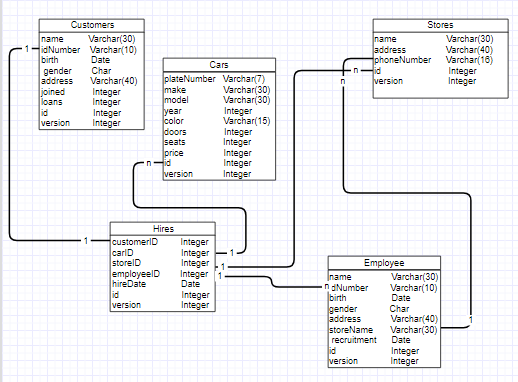

# car_renter

## 1. Követelményanalízis
**Egyszerű autók kölcsönzését/bérbeadását kezelő app. Eltárolhatjuk a kölcsönzők adatait, az autók adatait és az ügyintézők adatait is**
### 1.1 Követelmények

#### Funkcionális követelmények
 - Regisztráció
 - Bejelentkezés
 - Autók böngészése
 - Bejelentkezett felhasználóknak   
   - Rendelés létrehozása
   - Autó kiválasztása
   - Időpont foglalás
     - Autók elvitelére
     - Autók visszahozatalára
   - Adatok módosítása
 - Bejelentkezett ügyintézőknek
   - Rendelések jóváhagyása
   - Autók felvétele
   - Autók visszavétele
   - Autók kiadása
   - Autók törlése
#### Nem funkcionális követelmények
  - Felhasználóbarát: Megfelelően elhatárolt funkciók. Világos látható színekkel írt betűk. Ésszerű elrendezés
  - Biztonság: Jelszóval védett funkciók. A jelszavak titkosítottak.
    A különböző űrlapoknál egy hibalistában kijelzi a program a hibákat.
  - Gyors működés: Adatbázisban operáló program, gyors kereséssekkel hamar előállítja a kívánt eredményeket.
  - Autók képpel való megjelenítése: A felhasználók könnyebb döntése érdekében.

### 1.2 Szakterületi fogalomjegyzék

### 1.3 Használatieset-modell
    
#### Szerepek

- Vendég
- Bejelentkezett Felhasználó
- Ügyintéző

#### Modell

#### Folyamatok 
  - Autó/idópont foglalás
  

##### Egy egyszerű foglalás menete

 1. Először bejelentkezünk a szolgáltatásba.
 2. Böngészhetünk az autók között, vagy foglalhatunk időpontot.
 3. Kiválasztunk egy autót.
 4. Megadjuk mikor vesszük fel az autót.

## 3. Implementáció

### 3.1 Adatbázisterv

